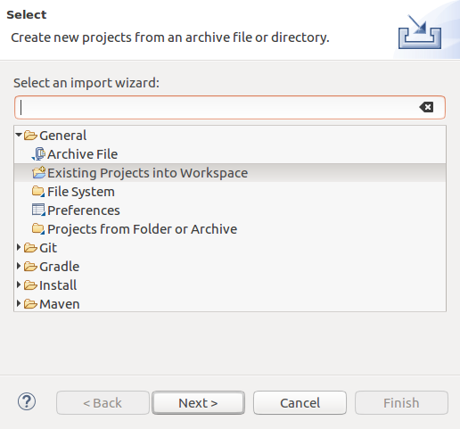

*Badges are out of date*

# DevOps
For information about the build system, see the release engineering documentation in [/doc/releng/README.md](./releng/README.md)

# Developers
## Requirements
 * [Java 8](http://www.oracle.com/technetwork/java/javase/overview/java8-2100321.html).
 * Maven - This is included in the default Eclipse installs

## Building and Running in Eclipse
This repository is an Eclipse project and can be easily imported and built within the Eclipse IDE. This has been tested on:
 * [Eclipse Oxygen](https://www.eclipse.org/oxygen/)
 * [Eclipse Photon](https://www.eclipse.org/photon/)

### 1. Get the Code
Clone this repository to your local computer. The created folder will be referred to as `<CS471-Assignments-UMLSorting>`.

### 2. Import the Project into Eclipse
 * Open Eclipse
 * From the main menu bar, select `File > Import...` to open the import wizard (see below).

 

 * Select the directory you created when cloning the code in Step 1 (i.e., `<CS471-Assignments-UMLSorting>`).
 * Click `Finish`
 
Refer to the official Eclipse [help documentation](http://help.eclipse.org/oxygen/index.jsp?topic=%2Forg.eclipse.platform.doc.user%2Ftasks%2Ftasks-importproject.htm) for more details about importing a project into Eclipse.

### 3. Build
If you do not have Eclipse configured to automatically build projects, then use the menu option `Project > Build Project` to build it.

### 4. Run
A [run configuration](../CS471-Assignments-UMLSorting.launch) is included. It allows you to use the use the toolbar to launch the program.


Click the dropdown on the toolbar to click the configuration to launch the program.


Once the program is ran successfully, you should see a window similar to the following:


## Building and Running on the Command Line
Clone the repository and build using maven.
```bash
	git clone <url>
	cd <CS471-Assignments-UMLSorting>
	mvn clean compile exec:java
```

## Reference Documentation

### Maven Site
Some documentation is automatically generated using maven.
 * JavaDoc
 * JUnit Reports
 * Code Coverage Reports
 
To build and view these:
```bash
	mvn site
```
Then open the generated file `<CS471-Assignments-UMLSorting>/target/site/project-reports.html`.
    
### Sequence Diagrams
See the [sequence diagram README](./doc/sequence-diagrams/README.md) for examples and instructions for creating sequence diagrams.
